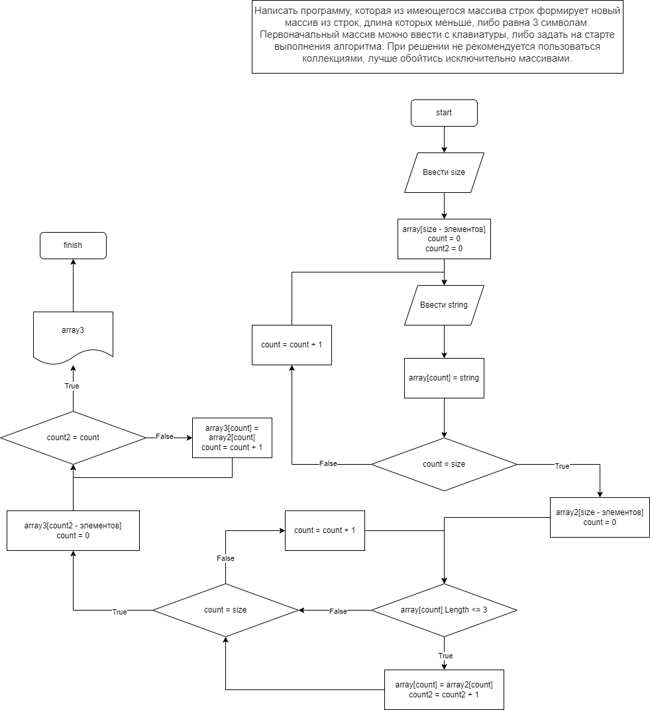

# Итоговая контрольная работа по основному блоку
## Задача:
Написать программу, которая из имеющегося массива строк формирует новый массив из строк, длина которых меньше, либо равна 3 символам. Первоначальный массив можно ввести с клавиатуры, либо задать на старте выполнения алгоритма. При решении не рекомендуется пользоваться коллекциями, лучше обойтись исключительно массивами.

Примеры:  
[“Hello”, “2”, “world”, “:-)”] → [“2”, “:-)”]  
[“1234”, “1567”, “-2”, “computer science”] → [“-2”]  
[“Russia”, “Denmark”, “Kazan”] → []

## Решение:
1. Запустить программу коммандой "dotnet run".
2. Появится надпись: "Введите количество элементов массива".
3. Необходимо ввести число через клавиатуру.
4. Программа будет поочерёдно запрашивать ввод каждого элемента. Значение элемента может содержать цифры, символы и латинские буквы.
5. После ввода всех элементов массива программа выведет на экран весь массив.
6. Следующим этапом программа выберет элементы массива с длинной 3 и менее символов, и выведет новый массив. 

## Блок-схема
